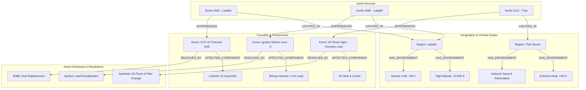

# Mission Records, ATA Directives & Knowledge Graph
**DRDO / iDEX Problem Statement ID: 26054**  
*Authoritative ATA Engineering Grounding, Markdown Sortie Records & Graph-Based Mission Intelligence*

---

## 📌 1. Authoritative ATA Engineering Grounding Specification

In aerospace defence operations, AI diagnostics cannot hallucinate or generate vague suggestions. The Diagnostic Agent grounds every AI explanation, fault classification, and emergency checklist in **official Rotax 912 iS OEM engineering manuals and DRDO flight operational limits**.

### ATA Chapter Breakdown

| ATA Chapter | System Area | Ground Truth Engineering Scope |
|---|---|---|
| **ATA 72-00** | **Engine Core & Cooling** | Cylinder head temp limits ($135^\circ\text{C}$ max), baffle seal geometry, cooling duct airflow, thermal expansion tolerances. |
| **ATA 72-10** | **Reduction Gearbox** | Gear reduction ratio ($i=2.43$), dog-clutch overload mechanism, 3rd harmonic vibration limits ($1.8\text{ mm/s}$). |
| **ATA 73-10** | **Fuel Injection (FADEC)** | High-pressure fuel rail ($3.0\text{ bar}$), twin injectors per runner, fuel flow balance curves, nozzle clogging symptoms. |
| **ATA 74-20** | **Dual Ignition System** | Dual spark plugs per cylinder, Lane A / Lane B ignition coils, dwell times, misfire vibration signatures. |
| **ATA 76-00** | **Engine Control (ECU)** | Dual-lane arbitration logic, sensor cross-check disparity limits ($\Delta \text{MAP} > 8\text{ kPa}$). |
| **ATA 79-00** | **Lubrication System** | Dry-sump reservoir, oil pump scavenge ratios, minimum oil pressure limit ($2.0\text{ bar}$), filter bypass operation. |
| **ATA 24-00** | **Electrical Power** | Alternator specs, DC bus nominal $14.1\text{ V}$, voltage sag thresholds ($<12.8\text{ V}$). |

---

## 📌 2. Standardized Mission Records (`MISSION_xxx.md`)

Each sortie file is maintained as an authoritative, human-readable analytical document with embedded machine-readable YAML frontmatter:

```markdown
---
sortie_id: "SORTIE-2026-LADAKH-042"
uav_tail_number: "TAPAS-BH-201-AF04"
date: "2026-08-28"
theater: "Northern Sector (Ladakh)"
base: "Leh Air Force Station (3,256m MSL)"
flight_profile: "High-Altitude ISR Loiter"
duration_hours: 18.5
ambient_environment:
  oat_range_celsius: [-28.0, -12.0]
  density_altitude_ft: [11000, 24500]
  humidity_percent: 18
telemetry_log_path: "data/telemetry/sortie_2026_ladakh_042.parquet"
engine_health_index_start: 0.98
engine_health_index_end: 0.81
primary_events_logged: 2
---

# Mission Debrief: SORTIE-2026-LADAKH-042

## 1. Environmental & Operational Context
* **Mission Regime:** 18.5-hour high-altitude border loiter at 22,000 ft MSL in sub-zero ambient conditions (-22°C OAT).
* **Thermal Stress Profile:** Severe cooling baffle contraction due to extreme thermal gradient between combustion chambers (950°C) and external air (-22°C).

## 2. Chronological Timeline & Anomaly Events
* **T+00:00 to T+04:15:** Nominal climb to 22,000 ft. All parameters inside green band.
* **T+04:16:30 [ANOMALY DETECTED]:** Cylinder #2 CHT baseline began drifting upward at $+0.38^\circ\text{C}/\text{min}$ despite constant cruise throttle (5,100 RPM).
* **T+05:02:10 [FAULT 01 CONFIRMED]:** Fast ML classifier confirmed *Cylinder #2 CHT Overheat* (Score: 0.94).
* **T+05:03:00 [ACTION TAKEN]:** Operator executed AI prescriptive directive: Enriched fuel trim +12%, reduced throttle to 4,600 RPM, and descended to 18,000 ft. Thermal runaway arrested at 128.4°C.

## 3. Post-Flight Maintenance Directives (Generated by Reasoning Agent)
- [x] **Inspection Order #882:** Baffle seal elastomeric hardening inspection on Cylinder #2 shroud.
- [ ] **Component RUL Update:** Remaining Useful Life of Cyl #2 head reduced from 420 hrs to 385 hrs.
```

---

## 📌 3. The Interconnected Mission Knowledge Graph



### Knowledge Graph Node & Edge Ontology
* **Node Types:** `Region`, `EnvironmentalContext`, `MissionSortie`, `AnomalyEvent`, `EngineSubsystem`, `ComponentMesh`, `RootCauseCitation`, `MaintenanceAction`.
* **CBM & Fleet Intelligence:** Maintainers can query past sorties to observe regional wear signatures (e.g. thermal baffle issues in sub-zero Ladakh vs. oil viscosity loss in Thar Desert).

---

## 📌 4. Historical Mission Replay & Reasoning Flow

```
┌────────────────────────────────────────────────────────┐
│   Historical Mission Record (Markdown + Telemetry DB)  │
└───────────────────────────┬────────────────────────────┘
                            │ Time-Indexed Data Stream (10–50 Hz)
                            ▼
┌────────────────────────────────────────────────────────┐
│            Digital Twin Replay / Physics Engine        │
│  • Feeds recorded CHT, EGT, RPM, Vibration over time   │
│  • Evaluates ML residuals in simulated real-time       │
└───────────────────────────┬────────────────────────────┘
                            │ Visual & State Hooks
                            ▼
┌────────────────────────────────────────────────────────┐
│        Native 3D Digital Twin Viewport & HUD           │
│  • Turntable smoothly rotates                          │
│  • Real-time dials scrub across the historical flight  │
│  • At T+04:16:30, camera sweeps to Cyl #2 and pulses   │
│  • Displays exact reasoning generated during flight    │
└────────────────────────────────────────────────────────┘
```
